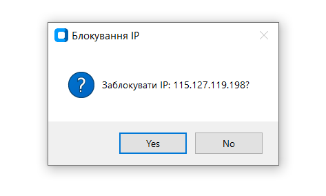

### Intrusion Detection and Prevention System (IDS/IPS) — Diploma Project

This repository contains experimental code developed as part of a diploma thesis:
**Development of an Intrusion Detection and Prevention System (IDS/IPS) Using Artificial Intelligence.**

The project ingests threat intelligence feeds, performs packet sniffing, correlates events, and can push firewall rules to mitigate suspicious activity.

⚠️ For research and educational purposes only. Do not use in production without thorough review and hardening.

---

### Project Overview

- **Goal**: Detect and optionally block malicious network activity using lightweight analytics and threat-intel feeds.
- **Language**: Python
- **Key capabilities**:
  - Network sniffing and event generation
  - Correlation against curated threat feeds (IPs/domains)
  - Optional firewall rule management to block indicators
  - Logging of alerts for analysis

---

### Repository Structure

- `main_app.py` — Entry point that wires components together and runs the system.
- `sniffer_logic.py` — Packet sniffing and detection logic.
- `data_handlers.py` — Utilities for parsing, normalizing, and working with feed/event data.
- `firewall_manager.py` — Applies/removes firewall rules based on detections.
- `config.py` — Centralized configuration and constants.
- `feeds_config.json` — Configuration for external threat feeds.
- `feeds/` — Static and generated threat-intel:
  - `bad_ips.txt`, `bad_domains.txt`
  - `generated/` CSVs sourced from providers (e.g., URLHaus)
- `logs/` — Alert logs with timestamps.
- `session_state.json` — Runtime/session state where applicable.

---

### Getting Started

#### Prerequisites
- Python 3.10+ recommended
- macOS or Linux (firewall features may require platform-specific adjustments and elevated privileges)
- Optional: virtual environment (recommended)

#### Installation
```bash
python3 -m venv .venv
source .venv/bin/activate
pip install -r requirements.txt  # If you have a requirements file; otherwise install needed deps manually
```

If you do not have a `requirements.txt`, install packages you use in your environment (e.g., `scapy`, `requests`, etc.).

#### Configuration
Review and adjust:
- `config.py` for runtime parameters
- `feeds_config.json` for feed sources and schedules

#### Running
```bash
python main_app.py
```

You may need to run with elevated privileges for packet capture and firewall operations:
```bash
sudo -E python main_app.py
```

---

### Logs and Outputs
- Alerts are written under `logs/` with date-stamped filenames.
- Generated feed data appears in `feeds/generated/`.
- Firewall actions are executed via `firewall_manager.py` and may require sudo privileges.

---

### Screenshots

Below are the images you added. If you want different alt text or order, let me know and I’ll adjust.




---

### Demo Videos

You added two `.mkv` recordings. Linked below with suggested labels:

- **GUI Demo (larger)**:  
[2025-06-02 10-18-54.mkv](2025-06-02%2010-18-54.mkv)

- **AI API Demo (smaller)**:  
[2025-05-31 12-12-26.mkv](2025-05-31%2012-12-26.mkv)

Note: Large media can bloat Git history. Consider using Git LFS or hosting externally for long-term storage.

---

### Roadmap Ideas
- Pluggable ML models for anomaly detection
- Enrichment from additional TI providers
- Cross-platform firewall backends
- Web UI for alert triage and rule control

This repository contains experimental and partially obfuscated code developed as part of a diploma thesis:  
**"Development of an Intrusion Detection and Prevention System (IDS/IPS) Using Artificial Intelligence."**

⚠️ Note: The code here is for **research and educational purposes only** and may include prototype or test components not intended for production use.

---

### Attribution
- Inspired by ideas from community IDS projects (e.g., Maltrail) while implementing a bespoke pipeline for this thesis.

and i don't remember if here any AI API, so use if u find it XDDD, IDC 

actully the idea was from maltrail, and that one so bullshit, either way, it got me 150$
